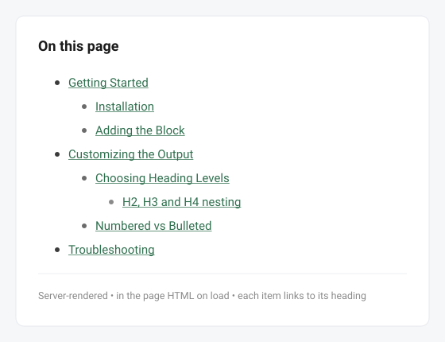
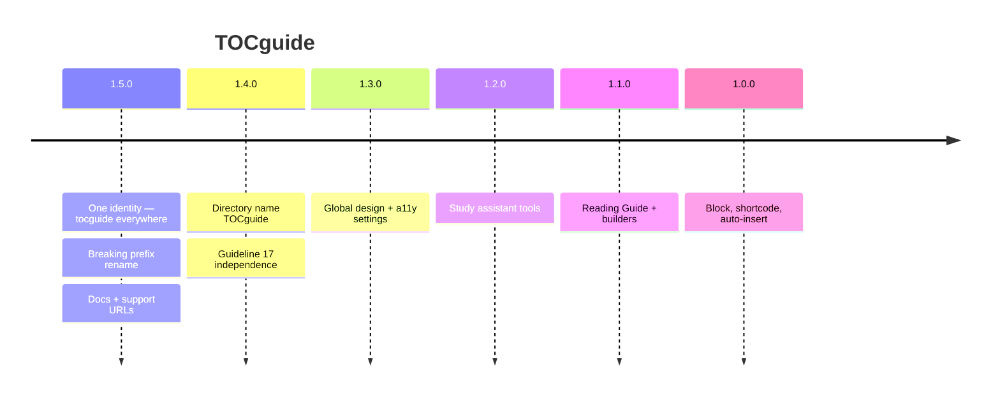
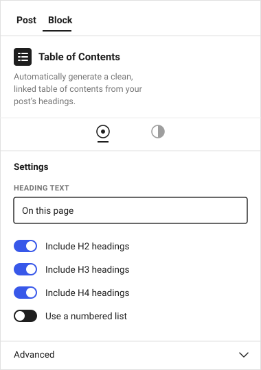

# TOCguide

<p align="center">
  
</p>

<p align="center">
  <strong>The Table of Contents that reads with your reader.</strong><br>
  One Gutenberg block. A linked outline from your headings — plus an optional Reading Guide:<br>
  section previews, read time, study tools, and citations. Server-rendered. No accounts. No tracking.
</p>

<p align="center">
  <a href="https://matthummel-pa.github.io/tocguide/"><strong>Docs</strong></a>
  ·
  <a href="https://matthummel-pa.github.io/tocguide/support.html">Support</a>
  ·
  <a href="https://github.com/matthummel-pa/tocguide/releases/latest">Download tocguide.zip</a>
  ·
  <a href="https://github.com/matthummel-pa/tocguide/issues">Issues</a>
  ·
  <a href="LICENSE">GPLv2 or later</a>
</p>

<p align="center">
  <a href="https://github.com/matthummel-pa/tocguide/actions/workflows/ci.yml"></a>
  
  
  
  
  
</p>

<p align="center">
  Independent plugin by Matt Hummel. Slug, folder, text domain, block, and GitHub repo: <code>tocguide</code>.<br>
  Not affiliated with any other company or plugin.
</p>

<p align="center">
  
</p>

---

## Why TOCguide

Most Table of Contents plugins stop at a list of links. TOCguide starts there and then helps people **read** the post.

| You get | Why it matters |
| --- | --- |
| **The outline is in the HTML** | Search engines and screen readers see it before JavaScript. |
| **Anchors match the list** | IDs are injected from the same heading map. Custom HTML anchors win. |
| **Reading Guide (opt-in)** | Previews, density bars, `~N min` badges, progress fade — computed from your content, not an API. |
| **Study tools (opt-in)** | Progress bar, resume bookmark, private note pads, citations, export — all `localStorage` or clipboard. |
| **Works where you write** | Gutenberg block, `[tocguide]` shortcode, auto-insert, Elementor / Divi / Bricks and the other builders we document. |
| **Theme-native** | The published TOC inherits the theme. No branded font on the front end. |

Zero config for the default path: insert the block, get an accessible `<nav>`.

---

## Releases at a glance



| Version | Ship | What people notice |
| :---: | :---: | --- |
| **1.5.0** | **Now** | One slug everywhere: PHP, CSS, block `tocguide/table-of-contents`, `[tocguide]`, settings key. **Re-insert the block** if you used an earlier zip. |
| 1.4.0 | Sep 2026 | Public name TOCguide for WordPress.org guideline 17. |
| 1.3.x | Sep 2026 | Sitewide colors/fonts, focus rings, and the color-picker escape fix. |
| 1.2.x | Sep 2026 | Progress bar, bookmark, reader notes, Section Planner. |
| 1.1.0 | — | Reading Guide, citations, hover previews, page-builder headings. |
| 1.0.x | — | Core TOC block, shortcode, auto-insert, five Block Styles. |

Full prose: [`CHANGELOG.md`](CHANGELOG.md) · directory copy: [`readme.txt`](readme.txt).

### v1.5.0 — one identity

| Surface | Value |
| --- | --- |
| Display name | **TOCguide** |
| Slug / folder / text domain | `tocguide` |
| Main file | `tocguide.php` |
| Block | `tocguide/table-of-contents` |
| Shortcode | `[tocguide]` |
| Option | `tocguide_settings` |
| CSS | `.tocguide`, `--tocguide-*` |
| Skip a heading | `no-toc` or `tocguide-skip` |
| GitHub + Pages | `matthummel-pa/tocguide` |

**Upgrade:** re-insert the Table of Contents block, update any custom CSS, and save **Settings → TOCguide**. Old keys are not migrated.

### v1.3.3 — colours and focus actually print

| Fix | Detail |
| --- | --- |
| `$guide_attrs` order | Focus-ring `data-tocguide-focus` was wiped before render |
| Global design props | `--tocguide-bg`, `--tocguide-color`, borders, fonts reach the `<nav>` |

### v1.3.0 — design & accessibility settings

| Feature | Where |
| --- | --- |
| Background, text, link, type, border, padding | Settings → Design & Appearance (`--tocguide-*`) |
| Reading Guide / study / export defaults | Settings → TOCguide |
| Focus ring: default / bold / high-contrast | Settings → Accessibility |

### v1.2.0 — study assistant

| Feature | Enable | State |
| --- | --- | --- |
| Reading progress bar | Study Tools or `rprogress="1"` | `IntersectionObserver` |
| Resume bookmark | `bookmark="1"` | `localStorage` `tocguide-bm-{post}` |
| Reader note pads | `rnotes="1"` | `localStorage` `tocguide-rn-…` |
| Section Planner | Block sidebar | `sectionStatus` attribute (editor only) |

All off by default. Nothing writes to a custom table. Nothing phones home.

### v1.1.0 — Reading Guide & builders

Reading Guide, hover previews, emoji reactions, academic citations, export/print, Elementor / Bricks / Divi / WPBakery / Oxygen / Beaver / Breakdance heading maps. See the feature tables in older README history via git if you need the original grid.

---

## WordPress.org listing notes

Written for Plugin Directory review (FAQ + 18 guidelines). This is a **Plugin Directory** plugin (settings + shortcode + auto-insert), not Block Directory.

| Guideline | How TOCguide handles it |
| --- | --- |
| **1 GPL** | Entire zip is GPLv2 or later (`LICENSE` / `license.txt`). |
| **4 Human-readable** | Unminified `src/` ships; `npm run build` is documented. |
| **5 No trialware** | Full feature set in this free plugin. |
| **7 No tracking** | No analytics, no phone-home, no accounts. See [`PRIVACY.md`](PRIVACY.md). |
| **8 No remote code** | No CDN JS/CSS in the plugin. Assets enqueued from `build/`. |
| **10 No forced credits** | No front-end “powered by” link. |
| **11 Admin** | Settings under **Settings → TOCguide**. Welcome notice is dismissible. |
| **12 Readme** | Five tags. Copy is for humans, not keyword stuffing. |
| **13 Core libraries** | No bundled jQuery. Gutenberg packages via `wp-scripts`. |
| **17 Trademarks** | Independent name **TOCguide** / slug **`tocguide`**. |

**Third-party services:** none. Do not confuse the GitHub Pages site (Outfit from Google Fonts in `docs/*.html`) with the plugin zip — WordPress sites do not load that font from this plugin.

**Capabilities:** settings require `manage_options`. Welcome dismiss uses a nonce (`tocguide_dismiss_welcome`).

**Uninstall:** `uninstall.php` runs on delete, not deactivate. Options are removed only if the owner opted in.

**Source:** `src/` (JS/SCSS) + `includes/` (PHP). Compiled assets in `build/` (gitignored; CI and `plugin-zip` build them).

---

## Features

- Live editor preview as you add or edit headings
- H1–H6 (H1 off by default), numbered or bulleted, five Block Styles
- Smooth scroll + offset (`prefers-reduced-motion` respected)
- Collapse/expand, sticky outline, scroll-spy
- Auto-insert (top of content or after the first heading)
- `[tocguide]` shortcode for classic content and page builders
- Skip a heading with `no-toc` or `tocguide-skip`
- Optional ItemList JSON-LD (off by default)
- Settings + Docs & Support in wp-admin

<p align="center">
  
</p>

---

## Performance

TOCguide is built to add **zero measurable overhead** on pages that don't use it, and minimal overhead on pages that do.

| Concern | How TOCguide handles it |
|---|---|
| **Assets on unrelated pages** | JS + CSS only load on singular posts/pages that contain the block, shortcode, or auto-insert target. The `enqueue_front_assets()` check gates all enqueues. |
| **Front-end JavaScript** | `view.js` — ~12 KB minified. Loaded via `block.json` `viewScript`. No jQuery. No framework. |
| **Front-end CSS** | `style-index.css` — ~20 KB minified. One file; no render-blocking imports. |
| **Scroll event handlers** | Features use `IntersectionObserver`. Any `scroll` listener is `{ passive: true }`. |
| **localStorage writes** | Reader notes ~400 ms debounce; bookmark ~500 ms. Nothing is written until a study tool is enabled. |
| **PHP database queries** | Heading maps cache in a static array — at most one `get_post()` per post per request. |
| **Remote calls** | None. |
| **`the_content` filters** | Priority 12 and 999, guarded by `is_singular() && in_the_loop() && is_main_query()`. Builder ID injection short-circuits on Gutenberg-only posts. |
| **`prefers-reduced-motion`** | Smooth scroll and CSS transitions respect the OS preference. |

---

## Install

Current version: **1.6.3**.

1. Download `tocguide.zip` from [Releases](https://github.com/matthummel-pa/tocguide/releases).
2. In WordPress: **Plugins → Add New → Upload Plugin**.
3. Activate. Optional: **Settings → TOCguide**.

Or clone this repo into `wp-content/plugins/tocguide`, run `npm install && npm run build`, and activate.

### Use the block

1. Edit a post that has **Heading** blocks.
2. Insert **Table of Contents** (usually right after the intro).
3. In the sidebar: title, heading levels, list style, preset, collapse, sticky, Reading Guide.

### Shortcode

```
[tocguide]
[tocguide title="On this page" ordered="1" style="boxed"]
```

---

## Develop

Requires **Node.js 20+** (`.nvmrc`). PHP 7.4+ for runtime; PHPCS via Composer in CI.

```bash
git clone https://github.com/matthummel-pa/tocguide.git
cd tocguide
npm install
npm run start          # watch → build/
npm run build          # production
npm run lint:js
npm run lint:css
npx --package=@wordpress/env wp-env start   # optional local WordPress
```

```bash
composer install
composer phpcs
```

`build/` is gitignored. You must build before the block registers (`register_block_type( …/build )`).

| Path | Role |
| --- | --- |
| `tocguide.php` | Headers, constants, boot |
| `includes/class-tocguide-*.php` | Settings, headings, plugin, admin |
| `src/block.json` | Block metadata (`apiVersion` 3, dynamic) |
| `src/edit.js` / `view.js` / `style.scss` | Editor, front JS, shared CSS |
| `src/render.php` | Markup only — no function declarations |
| `admin/` | Settings + Docs & Support UI |
| `docs/` | GitHub Pages (`/docs` on `main`) |
| `.wordpress-org/` | Banner/icon sources for SVN `assets/` (not in the plugin folder) |

**Conventions**

- Text domain is the literal `'tocguide'` (never a constant).
- Dynamic block: `save.js` returns `null`; PHP renders.
- Prefix functions `tocguide_`, classes `TOCguide_`, constants `TOCGUIDE_`.
- Do not load Core copies of jQuery. Do not execute remote JS.
- Front-end TOC must not inject a branded (or serif) font.

Filters (documented in [`docs/documentation.html`](https://matthummel-pa.github.io/tocguide/documentation.html)): `tocguide_headings`, `tocguide_nav_classes`, `tocguide_render_nav`, `tocguide_skip_post_types`.

Release: bump `tocguide.php`, `TOCGUIDE_VERSION`, `package.json`, `src/block.json`, `readme.txt` Stable tag, then tag `vX.Y.Z` (Actions builds `tocguide.zip`). WordPress.org: `npm run package:svn` and commit that tree to SVN (`docs/marketplace/wordpress-org.md`).

See [`docs/DEVELOPER_SOP.md`](docs/DEVELOPER_SOP.md) and [`CONTRIBUTING.md`](CONTRIBUTING.md).

---

## Documentation

| Doc | Who it is for |
| --- | --- |
| [Support site](https://matthummel-pa.github.io/tocguide/) | Users, buyers, reviewers |
| [Full documentation](https://matthummel-pa.github.io/tocguide/documentation.html) | Install, sidebar, shortcode, builders |
| [Support policy](https://matthummel-pa.github.io/tocguide/support.html) | What we cover |
| [User guide](docs/USER_SOP.md) | Site owners (repo copy) |
| [Developer SOP](docs/DEVELOPER_SOP.md) | Contributors |
| [Support policy (repo)](SUPPORT.md) | Buyers / WordPress.org users |
| [Security](SECURITY.md) · [Privacy](PRIVACY.md) | Vulns and data handling |
| [Marketplace kit](docs/marketplace/README.md) | WordPress.org and CodeCanyon |
| [Changelog](CHANGELOG.md) | Release history |
| [WordPress.org rules](docs/wordpress-org/PLUGIN_DIRECTORY.md) | Plugin Directory FAQ + guidelines |
| [Naming](docs/NAMING.md) | Locked slug / text domain |

---

## License

[GPLv2 or later](LICENSE) — the whole plugin (PHP, JavaScript, CSS, and images), same family as WordPress.

Copyright © 2026 Matt Hummel.
